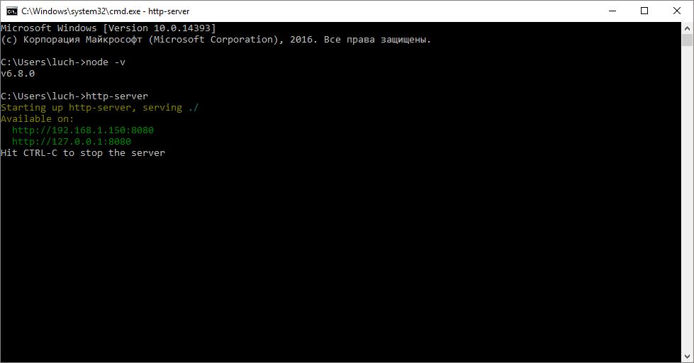
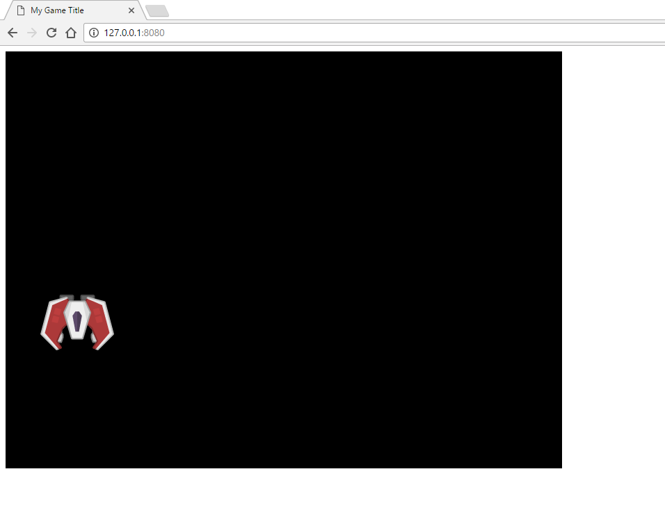

# Туториал 1

В этом туториале будет рассказано как за 15 минут начать делать игры. А именно как загрузить, создать, добавить спрайт на холст и заставить его двигаться

-----

### Установка окружения
* Для начала установите [Node.JS](https://nodejs.org/), выбирайте Recommended версию.
* Затем откройте консоль, для начала нажмите комбинацию клавишь`WIN + R`, и наберите cmd, затем нажмите "OK" - должно появиться чёрное окошко.
* Проверьте установлена ли Node.JS набрав в консоли команду: `node -v`, должна отобразиться версия установленного Node.JS. Если версия не отобржается, попробуйте, перезапустить ваш PC.
* Если отобразилась версия, то попробуйте установить простой http сервер командой `npm install http-server -g`, тем самым вы установите http-server. После перезапустите консоль и наберите http-server,
вы должны увидите что - то подобное:

Это будет означать, что веб сервер запустился в паке C:\Users\username. Чтобы прекратить работу сервера нажмите `CTRL + С` или просто зайкройте консоль.
* Далее создайте папку в которой будет ваша будущая игра.
* Затем нужно будет с помошью консоли в неё перейти - для этого, вам нужно скопировать полный путь до папку, например, папка называется MyGame и на ходится на диске "C", значит полный путь к ней будет `C:\MyGame`. Чтобы перейти в папу MyGame через консоль, нужно набрать команду `cd` и путь до папки `cd C:\MyGame`.
* После того, как вы перешли через консоль в папку с вашей игрой, запустите "http-server".
### Написание игры
* После запуска сервера, создайте файл "index.html" внутри папки, в которую вы перешли. Откройте браузер и перейдите по ссылке. "http://127.0.0.1:8080", вы увидете пустую страницу.
* Затем добавть код:
```html
<!DOCTYPE html>
<html>
  <head>
    <meta charset="utf-8">
    <title>My Game Title</title>
  </head>
  <body>
    <script src="https://cdnjs.cloudflare.com/ajax/libs/phaser/2.6.2/phaser.min.js" charset="utf-8"></script>
    <script src="js/app.js" charset="utf-8"></script>
  </body>
</html>
```
* После чего создайте папку "js", а внутри неё файл "app.js" и напишите в него:
```js
var GAME_WIDTH = 800;
var GAME_HEIGHT = 600;
var game = new Phaser.Game(GAME_WIDTH, GAME_HEIGHT);
```
* `GAME_WIDTH` - ширина экрана в пикселях.
* `GAME_HEIGHT` - высота экрана в пикселях.
* После того, как внесли изменения в код и сохранили их, попробуйте перезапустить пару раз страницу. После перезапуска можно увидеть чёрный экран.
* После создайте папку "images" в вашей папке "MyGame" (не в папке "js") и добавте в неё изображение "ship.png", которое можно взять [отсюда](images/ship.png).
* Затем добавте код "игрового экрана":
```js
var startScreen = {
  init: function() {
  },

  preload: function() {
    var imagePath = 'images/ship.png';
    var imageName = 'ship';

    game.load.image(imageName, imagePath);
  },

  create: function() {
    var x = 50;
    var y = 50;

    var imageName = 'ship';

    this.sprite = game.add.sprite(x, y, imageName);
  },

  update: function() {
    this.sprite.y += 1;
  }
}
```
* При запуске игры, первой вызывается функция `init`, затем `preload`, затем `create` и в конце запускается игровой цикл (который мы не видим), который вызывает функцию `update` 60 раз в секунду.
* Функция `init` нужна для инициализации ваших переменных, если вам нужно заранее, до запуска "игрового экрана" создать переменные, то лучше всего использовать эту функцию.
* Функция `preload` нужна для загрузки изображений, звуков и других объектов в игру. Внутри неё мы задаём относительный путь до изображения `imagePath` и имя, под которым будет храниться изображение в кеше. После чего эти переменные передаются в функцию `game.load.image`, которая загрузит наше изобрежение в кеш (память).
* Внутри функции `create` создаётся "спрайт" с координатами "x, y", этот спрайт легко передвигать, вращать, изменять с помощью его свойств, узнать больше о свойствах спрайта можно на оффициальном сайте [документации Phaser](http://phaser.io/docs/2.6.2/Phaser.Sprite.html).
* И внутри фукции `update`, которая вызывается 60 раз в секунду, происходит движение нашего спрайта вниз со скоростью 60 пикселей в секунду. Почему вниз? Потому что, система отсчёта начинается от левого перхнего угла, то есть в левом верхнем углу координаты: (0, 0), а в правом нижнем углу (800, 600), так как размер игровго поля мы задали 800x600. Если вы хотите, чтобы спрайт двигался со скоростью 30 пикслей в секунду, то замените код на: `this.sprite.y += 0.5;`
* Чтобы всё заработало, нужно добавить две последние строки:
```js
game.state.add('startScreen', startScreen);
game.state.start('startScreen');
```
* Первая строка добавляет игровой экран на холст
* Вторая строка запускает игровой экран и можно увидеть космический корабль, который плавно движется вниз:


* Попробуйте поэксперементировать самостоятельно с this.sprite.x и this.sprite.width
* Попробуйте создать второй спрайт `this.sprite2 = game.add.sprite(50, 50, 'ship')`
-----


Если у вас остались вопросы по туториалу, то можете их задать через почту luchansodev@gmail.com или в сообществе [Luchanso Talk](https://discord.gg/Cb4EEEn)
